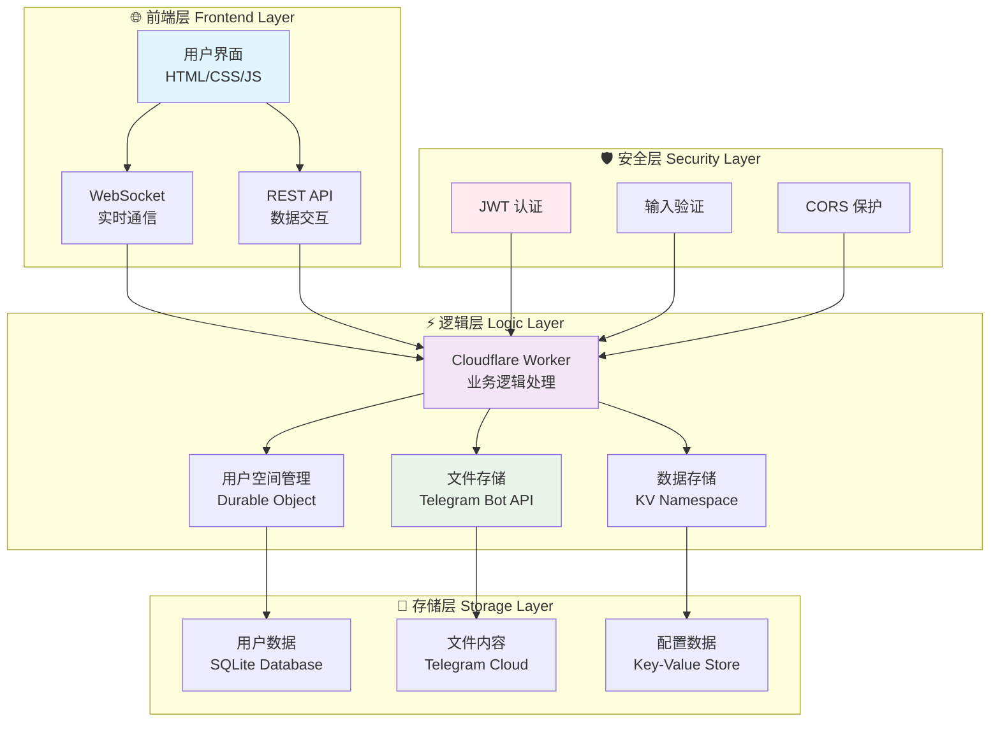
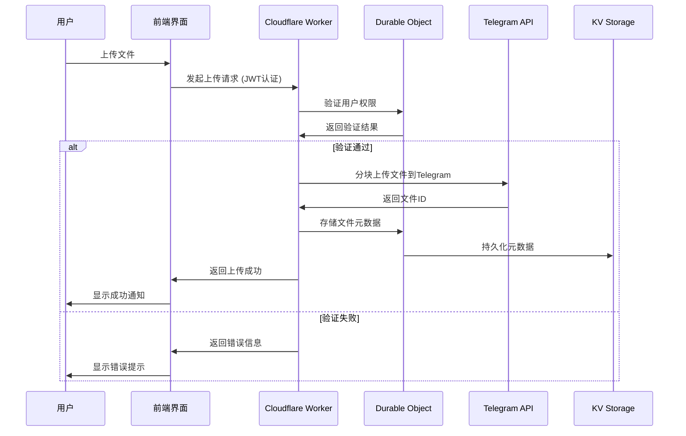

# 🌩️ Ultimate Cloud Drive - 终极云盘

> 🚀 **基于 Cloudflare Workers + Telegram 存储的现代云存储解决方案** | 🎯 **无限空间体验 · 2GB大文件支持 · 企业级分享功能**


## 📖 目录
- [✨ 项目简介](#-项目简介)
- [🎯 核心特性](#-核心特性)
- [🛠️ 技术栈](#️-技术栈)
- [🏗️ 系统架构](#️-系统架构)
- [🚀 快速开始](#-快速开始)
- [📚 详细教程](#-详细教程)
- [🔧 技术原理](#-技术原理)
- [🌟 项目优势](#-项目优势)
- [📈 发展路线](#-发展路线)
- [🤝 贡献指南](#-贡献指南)
- [📄 开源协议](#-开源协议)

## ✨ 项目简介

### 🎪 项目概述
**Ultimate Cloud Drive** 是一个创新的云存储平台，基于 **Cloudflare Workers** 无服务器架构，并利用 **Telegram Bot API** 作为存储后端。它将 Telegram 的免费云存储空间转化为个人云盘，提供媲美商业产品的用户体验。

### 💡 设计理念
> 🧠 **"将现有免费资源重新组合，创造更大价值"**

我们相信优秀软件应该：
- 🎯 **简单易用** - 零配置快速上手
- ⚡ **高效稳定** - 边缘计算 + 全球加速
- 💰 **成本友好** - 完全免费使用
- 🔒 **安全可靠** - 多层安全防护

## 🎯 核心特性

### 🗂️ 文件管理
| 功能 | 图标 | 状态 | 描述 |
|------|------|------|------|
| 文件夹管理 | 📁 | ✅ | 完整的文件夹操作支持 |
| 多选操作 | 🎯 | ✅ | 批量选择、分享、删除 |
| 实时搜索 | 🔍 | ✅ | 快速文件搜索定位 |
| 面包屑导航 | 🍞 | ✅ | 清晰的路径导航体验 |

### ☁️ 上传下载  
| 功能 | 图标 | 状态 | 描述 |
|------|------|------|------|
| 分块上传 | 🚀 | ✅ | 大文件稳定上传 |
| 2GB 支持 | 💪 | ✅ | 单文件最大2GB |
| 并发上传 | 🌀 | ✅ | 同时上传多个文件 |
| 拖拽上传 | 🖱️ | ✅ | 拖拽文件/文件夹上传 |

### 🔗 分享功能
| 功能 | 图标 | 状态 | 描述 |
|------|------|------|------|
| 密码保护 | 🔒 | ✅ | 为分享链接设置密码 |
| 时效控制 | ⏰ | ✅ | 灵活的有效期设置 |
| 访问统计 | 📊 | ✅ | 详细的访问数据分析 |
| 公开浏览 | 🌐 | ✅ | 无需登录即可访问 |

## 🛠️ 技术栈

### 🌐 后端技术
| 技术 | 用途 | 难度 | 特点 |
|------|------|------|------|
| **Cloudflare Workers** | 无服务器运行环境 | ⭐⭐⭐⭐☆ | 边缘计算，全球加速 |
| **Durable Objects** | 实时数据同步 | ⭐⭐⭐⭐⭐ | SQLite存储，WebSocket |
| **Telegram Bot API** | 文件存储后端 | ⭐⭐⭐⭐☆ | 免费存储，高可靠性 |
| **KV Storage** | 元数据存储 | ⭐⭐⭐☆ | 键值对数据存储 |

### 🎨 前端技术
| 技术 | 用途 | 难度 | 特点 |
|------|------|------|------|
| **原生 JavaScript** | 核心交互逻辑 | ⭐⭐⭐☆ | 轻量级，高性能 |
| **WebSocket** | 实时通信 | ⭐⭐⭐⭐☆ | 实时文件同步 |
| **Chart.js** | 数据可视化 | ⭐⭐⭐☆ | 丰富的图表展示 |

## 🏗️ 系统架构

### 📁 项目结构
```
online-cloud/
├── 📄 wrangler.toml          # Cloudflare Workers 配置
├── 📄 package.json           # 项目依赖管理
├── 📄 package-lock.json      # 依赖版本锁定
└── 📂 src/
    └── 📄 index.js           # 🎯 主应用代码 (前后端一体化)
```

### 🔄 架构流程图



### 🔧 核心组件交互



## 🚀 快速开始

### ⚡ 一键部署指南

#### 方法一：Cloudflare Dashboard 部署 🖥️
1. **登录 Cloudflare**: [点击进入 Dashboard](https://dash.cloudflare.com/)
2. **创建 Worker**: Workers & Pages → 创建应用 → 快速编辑
3. **复制代码**: 将本项目 `src/index.js` 内容复制到编辑器
4. **配置变量**: 在设置中添加环境变量
5. **部署发布**: 点击"保存并部署"

#### 方法二：Wrangler CLI 部署 💻
```bash
# 1. 安装 Wrangler CLI
npm install -g wrangler

# 2. 登录 Cloudflare
wrangler login

# 3. 初始化项目
git clone https://github.com/lzA6/online-cloud-cfwork.git
cd online-cloud-cfwork

# 4. 配置环境变量
wrangler secret put TELEGRAM_BOT_TOKEN
wrangler secret put TELEGRAM_CHANNEL_ID
wrangler secret put JWT_SECRET

# 5. 部署应用
wrangler deploy
```

### 🔧 详细配置教程

#### 步骤 1: 创建 Telegram Bot 🤖
1. 打开 Telegram，搜索 `@BotFather`
2. 发送 `/newbot` 创建新机器人
3. 记录机器人 token: `123456789:ABCdefGHIjklMNOpqrsTUVwxyz`
4. 设置机器人权限为可发送文件

#### 步骤 2: 准备 Telegram 频道 📢
1. 创建新的 Telegram 频道
2. 将机器人添加为频道管理员
3. 获取频道 ID (以 `-100` 开头的数字)
4. 确保机器人有发送消息权限

#### 步骤 3: 配置环境变量 🔐
```toml
# wrangler.toml
[vars]
TELEGRAM_BOT_TOKEN = "你的机器人Token"
TELEGRAM_CHANNEL_ID = "你的频道ID"
JWT_SECRET = "你的JWT密钥"

[[kv_namespaces]]
binding = "USERS_KV"
id = "用户数据KV ID"

[[kv_namespaces]]
binding = "SHARES_KV" 
id = "分享数据KV ID"

[[durable_objects.bindings]]
name = "USER_SPACE"
class_name = "UserSpace"

[[durable_objects.bindings]]
name = "STATS_AGGREGATOR" 
class_name = "StatsAggregator"
```

#### 步骤 4: 创建 KV Namespaces 📦
```bash
# 创建用户数据存储
wrangler kv:namespace create "USERS_KV"

# 创建分享数据存储  
wrangler kv:namespace create "SHARES_KV"
```

## 📚 详细教程

### 👤 用户注册登录

1. **首次访问应用**
   - 打开您的 Workers 域名
   - 系统显示登录/注册界面

2. **注册新账户**
   - 点击"立即注册"
   - 输入用户名和密码（至少6位）
   - 点击注册完成

3. **登录系统**
   - 输入用户名密码
   - 系统自动保存登录状态

### 📁 文件操作指南

#### 上传文件
- **单个文件**: 点击"上传" → "上传文件" → 选择文件
- **多个文件**: 直接拖拽到页面区域
- **整个文件夹**: 点击"上传" → "上传文件夹" → 选择文件夹
- **拖拽上传**: 拖拽文件到页面，显示蓝色区域时释放

#### 文件管理
- **新建文件夹**: 点击"新建文件夹" → 输入名称
- **删除文件**: 点击文件旁的 🗑️ 图标
- **批量操作**: 勾选多个文件 → 使用顶部工具栏
- **搜索文件**: 在搜索框输入文件名实时搜索

### 🔗 分享功能使用

#### 创建分享链接
1. 选择要分享的文件或文件夹
2. 点击"分享"按钮
3. 设置分享选项：
   - 🔒 **密码保护** (可选)
   - ⏰ **有效期** (7天/30天/永久)
4. 生成分享链接
5. 复制链接分享给他人

#### 访问分享内容
1. 打开分享链接
2. 输入密码（如设置）
3. 浏览文件或下载内容

## 🔧 技术原理

### 🏗️ 核心架构解析

#### Telegram 存储引擎
```javascript
class TelegramStorage {
  async uploadFile(file, fileName) {
    // 将文件分块上传到 Telegram 频道
    const formData = new FormData();
    formData.append('chat_id', this.channelId);
    formData.append('document', file, fileName);
    
    const response = await fetch(
      `https://api.telegram.org/bot${this.botToken}/sendDocument`,
      { method: 'POST', body: formData }
    );
    
    const result = await response.json();
    return result.result.document.file_id;
  }
  
  async downloadFile(fileId) {
    // 通过 file_id 获取文件下载链接
    const fileInfo = await fetch(
      `https://api.telegram.org/bot${this.botToken}/getFile?file_id=${fileId}`
    );
    
    const info = await fileInfo.json();
    return `https://api.telegram.org/file/bot${this.botToken}/${info.result.file_path}`;
  }
}
```

**技术优势**:
- 💰 **完全免费**: 利用 Telegram 免费存储空间
- 🌍 **全球加速**: Telegram 的全球 CDN 网络
- 🔒 **自动备份**: Telegram 的多数据中心冗余

#### Durable Objects 实时同步
```javascript
class UserSpace {
  constructor(state, env) {
    this.storage = state.storage; // SQLite 数据库
    this.sessions = []; // WebSocket 连接池
  }
  
  async addFileItem(newItem) {
    // 原子性事务操作
    await this.storage.transaction(async (txn) => {
      const items = await txn.get("items") || [];
      
      // 防止文件重名冲突
      const exists = items.some(item => 
        item.parentId === newItem.parentId && 
        item.name === newItem.name
      );
      
      if (!exists) {
        items.push(newItem);
        await txn.put("items", items);
        
        // 实时广播给所有客户端
        this.broadcast({
          type: "item_added", 
          item: newItem
        });
      }
    });
  }
}
```

### 🔐 安全机制

#### JWT 身份认证
```javascript
const utils = {
  jwt: {
    async encode(payload, secret) {
      // 生成 JWT Token
      const header = { alg: "HS256", typ: "JWT" };
      const encodedHeader = btoa(JSON.stringify(header));
      const encodedPayload = btoa(JSON.stringify(payload));
      const signature = await this.sign(encodedHeader + '.' + encodedPayload, secret);
      
      return `${encodedHeader}.${encodedPayload}.${signature}`;
    },
    
    async verify(token, secret) {
      // 验证 Token 有效性
      const parts = token.split('.');
      if (parts.length !== 3) return null;
      
      const isValid = await this.verifySignature(parts[0] + '.' + parts[1], parts[2], secret);
      return isValid ? JSON.parse(atob(parts[1])) : null;
    }
  }
}
```

#### 文件访问控制
```javascript
async function handleFileDownload(request) {
  const url = new URL(request.url);
  const fileId = url.searchParams.get("file_id");
  const token = url.searchParams.get("token");
  
  // 1. 验证用户权限
  const payload = await utils.jwt.verify(token, env.JWT_SECRET);
  if (!payload || !await hasFileAccess(payload.userId, fileId)) {
    return new Response("Forbidden", { status: 403 });
  }
  
  // 2. 从 Telegram 获取文件
  const downloadUrl = await telegramStorage.downloadFile(fileId);
  const fileResponse = await fetch(downloadUrl);
  
  // 3. 返回文件流
  return new Response(fileResponse.body, {
    headers: { 
      'Content-Type': 'application/octet-stream',
      'Content-Disposition': `attachment; filename="${getFileName(fileId)}"`
    }
  });
}
```

### 🎨 前端架构

#### 状态管理
```javascript
const state = {
  // 用户认证
  token: localStorage.getItem('authToken'),
  username: localStorage.getItem('username'),
  
  // 文件管理
  allItems: [],                    // 所有文件数据
  currentParentId: 'root',         // 当前目录
  selectedItemIds: new Set(),      // 选中文件
  
  // 上传管理
  uploadQueue: {},                 // 上传队列
  activeUploads: 0,                // 活跃上传数
  MAX_CONCURRENT_UPLOADS: 3,       // 并发上限
  
  // 实时通信
  socket: null,                    // WebSocket 连接
  isLoggingOut: false              // 退出状态
};
```

#### 组件通信机制
```javascript
// WebSocket 实时同步
function connectWebSocket() {
  const wsUrl = `${window.location.protocol === "https:" ? "wss" : "ws"}://${window.location.host}/?token=${state.token}`;
  
  state.socket = new WebSocket(wsUrl);
  
  state.socket.onmessage = (event) => {
    const data = JSON.parse(event.data);
    
    switch (data.type) {
      case 'item_added':
        // 实时添加新文件
        addItemToView(data.item);
        break;
        
      case 'items_deleted':
        // 实时删除文件
        removeItemsFromView(data.itemIds);
        break;
        
      case 'error':
        // 错误处理
        showErrorNotification(data.message);
        break;
    }
  };
}
```

## 🌟 项目优势

### 💡 技术创新点

#### 1. 🎯 存储成本优化
```
传统方案: 自建存储服务器 → 高昂硬件和维护成本
云服务方案: AWS S3/Cloudflare R2 → 按使用量付费
本方案: Telegram 免费存储 → 💰 零成本运营
```

#### 2. ⚡ 性能架构设计
- **边缘计算**: Cloudflare Workers 全球部署
- **实时同步**: WebSocket 即时数据更新  
- **并发处理**: 多文件同时上传下载
- **缓存优化**: 智能缓存减少重复请求

#### 3. 🔒 安全可靠性
- **多层认证**: JWT + 权限验证
- **数据加密**: 传输过程全程加密
- **输入验证**: 全面的 XSS 防护
- **错误隔离**: 组件级错误处理

### 📊 竞争优势对比

| 特性 | 传统网盘 | 商业云盘 | Ultimate Cloud Drive |
|------|----------|----------|---------------------|
| **成本** | 🟨 中等 | 🟥 昂贵 | 🟩 **完全免费** |
| **部署** | 🟥 复杂 | 🟨 中等 | 🟩 **一键部署** |
| **性能** | 🟨 一般 | 🟩 优秀 | 🟩 **全球加速** |
| **扩展** | 🟥 困难 | 🟨 中等 | 🟩 **自动扩展** |

## 📈 发展路线

### 🎯 短期目标 (1-3个月)
| 功能 | 优先级 | 状态 | 描述 |
|------|--------|------|------|
| 移动端适配 | 🔴 高 | 🟡 规划中 | 响应式移动端界面 |
| 文件预览 | 🔴 高 | 🟡 规划中 | 图片、文档在线预览 |
| 断点续传 | 🟡 中 | 🟡 规划中 | 上传中断恢复 |
| 操作历史 | 🟡 中 | 🟡 规划中 | 文件操作记录 |

### 🚀 中期目标 (3-6个月)
| 功能 | 优先级 | 状态 | 描述 |
|------|--------|------|------|
| 团队协作 | 🔴 高 | ⚪ 待规划 | 多用户文件协作 |
| 版本控制 | 🟡 中 | ⚪ 待规划 | 文件版本管理 |
| API 接口 | 🟡 中 | ⚪ 待规划 | 开发者 API |
| 插件系统 | 🟢 低 | ⚪ 待规划 | 功能扩展插件 |

### 🌟 长期愿景 (6-12个月)
| 功能 | 描述 | 技术挑战 |
|------|------|----------|
| AI 文件分类 | 智能文件分类整理 | ⭐⭐⭐⭐ |
| 多存储后端 | 支持多种存储提供商 | ⭐⭐⭐ |
| 双向同步 | 本地文件夹同步 | ⭐⭐⭐⭐⭐ |
| 企业版功能 | 企业级管理功能 | ⭐⭐⭐⭐ |

## 🛠️ 技术改进点

### 🔴 高优先级改进
1. **错误处理增强**
   ```javascript
   // 当前：基础错误处理
   try {
     await uploadFile(file);
   } catch (error) {
     showToast('上传失败');
   }
   
   // 改进：精细化错误处理
   class UploadError extends Error {
     constructor(type, message, originalError) {
       super(message);
       this.type = type; // 'network', 'quota', 'validation'
       this.originalError = originalError;
       this.timestamp = Date.now();
     }
   }
   ```

2. **性能监控**
   - 添加前端性能指标收集
   - 实现用户行为分析
   - 建立错误监控系统

### 🟡 中优先级改进
1. **代码模块化**
   ```javascript
   // 将大型文件拆分为模块
   // src/
   //   ├── storage/
   //   │   └── telegram.js
   //   ├── auth/
   //   │   └── jwt.js
   //   ├── websocket/
   //   │   └── handler.js
   //   └── frontend/
   //       └── app.js
   ```

2. **测试覆盖**
   - 添加单元测试
   - 集成测试
   - E2E 测试

### 🟢 低优先级改进
1. **国际化支持**
2. **无障碍访问**  
3. **更多主题选项**

## 🤝 贡献指南

### 🎯 开发环境搭建
```bash
# 1. 克隆项目
git clone https://github.com/lzA6/online-cloud-cfwork.git

# 2. 安装依赖
npm install

# 3. 配置环境变量
cp .env.example .env
# 编辑 .env 文件填入你的配置

# 4. 本地开发
wrangler dev

# 5. 访问 http://localhost:8787
```

### 📝 代码贡献流程

1. **Fork 项目**
   - 点击 GitHub 页面的 Fork 按钮

2. **创建功能分支**
   ```bash
   git checkout -b feature/amazing-feature
   ```

3. **提交更改**
   ```bash
   git commit -m "feat: 添加了很棒的功能"
   ```

4. **推送到分支**
   ```bash
   git push origin feature/amazing-feature
   ```

5. **创建 Pull Request**

### 🐛 问题反馈模板
```markdown
## 问题描述
清晰描述遇到的问题

## 重现步骤
1. 
2. 
3. 

## 预期行为
期望发生什么

## 实际行为
实际发生了什么

## 环境信息
- 系统: [如 Windows 10]
- 浏览器: [如 Chrome 90]
- 版本: [如 v1.0.0]
```

## 📄 开源协议

### Apache 2.0 协议

本项目采用 **Apache License 2.0** 开源协议：

**✅ 允许事项：**
- ✅ 商业使用
- ✅ 修改分发  
- ✅ 专利使用
- ✅ 私人使用

**📝 要求事项：**
- 📝 保留版权声明
- 📝 声明修改内容
- 📝 包含许可文本

**⚠️ 免责声明：**
- ⚠️ 无担保责任
- ⚠️ 无售后支持

完整协议内容请查看 [LICENSE](LICENSE) 文件。

---

## 🎉 结语

> **"技术创新的本质，是用更聪明的方式解决老问题"**

这个项目展示了如何：
- 🎯 **巧妙组合** 现有免费服务构建完整产品
- ⚡ **极致优化** 用户体验和性能表现  
- 💰 **零成本** 实现商业级功能
- 🔧 **易于扩展** 的模块化架构

无论您是：
- 🎓 **学习者** - 想了解现代全栈开发
- 🔧 **开发者** - 需要云存储解决方案
- 🚀 **创业者** - 想要快速验证想法

这个项目都为您提供了完美的起点和实践案例。

**⭐ 如果这个项目对您有帮助，请给个星星支持我们！**

---

<div align="center">

**🙏 感谢您花时间阅读这份文档！**  

让我们一起让这个项目变得更好：

[⭐ Star 项目](https://github.com/lzA6/online-cloud-cfwork) · 
[🐛 报告问题](https://github.com/lzA6/online-cloud-cfwork/issues) · 
[💡 建议功能](https://github.com/lzA6/online-cloud-cfwork/discussions) · 
[🔧 贡献代码](https://github.com/lzA6/online-cloud-cfwork/pulls)

**Happy Coding! 🚀**

</div>
